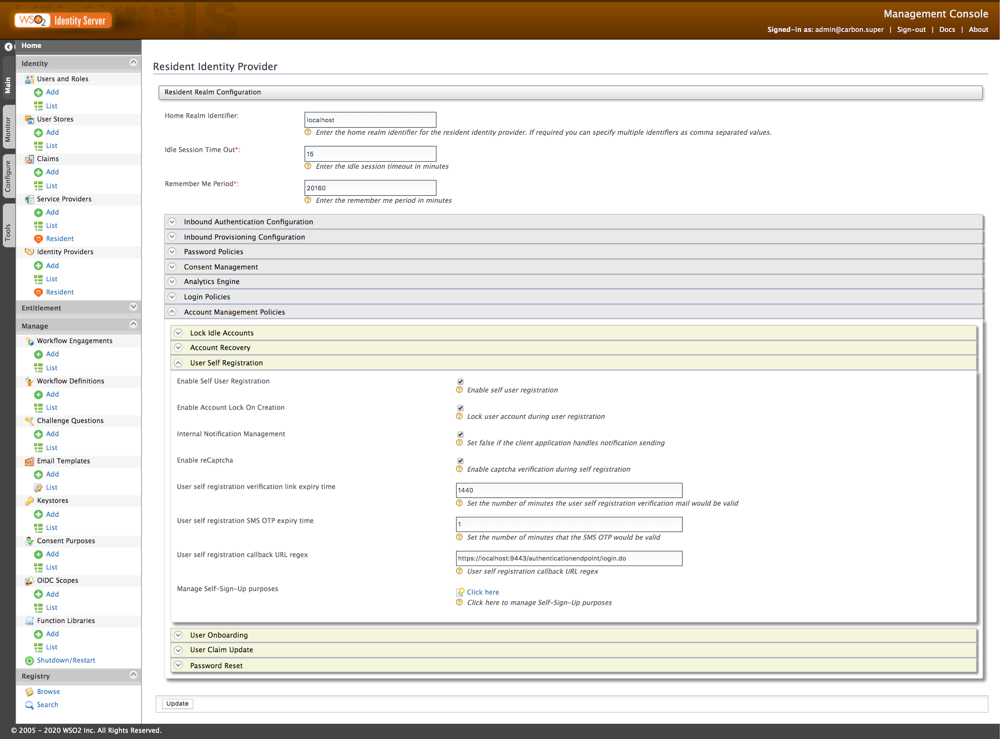
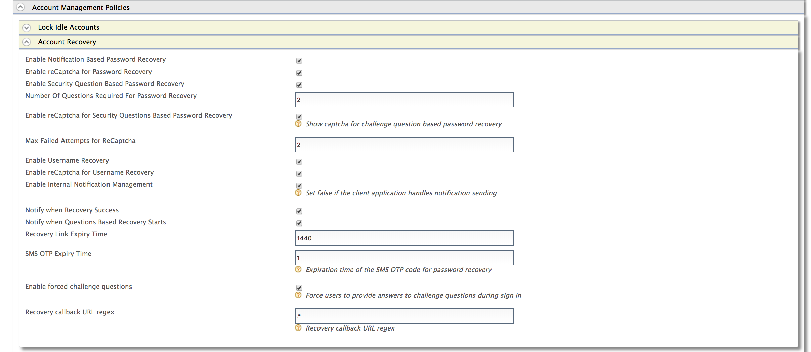
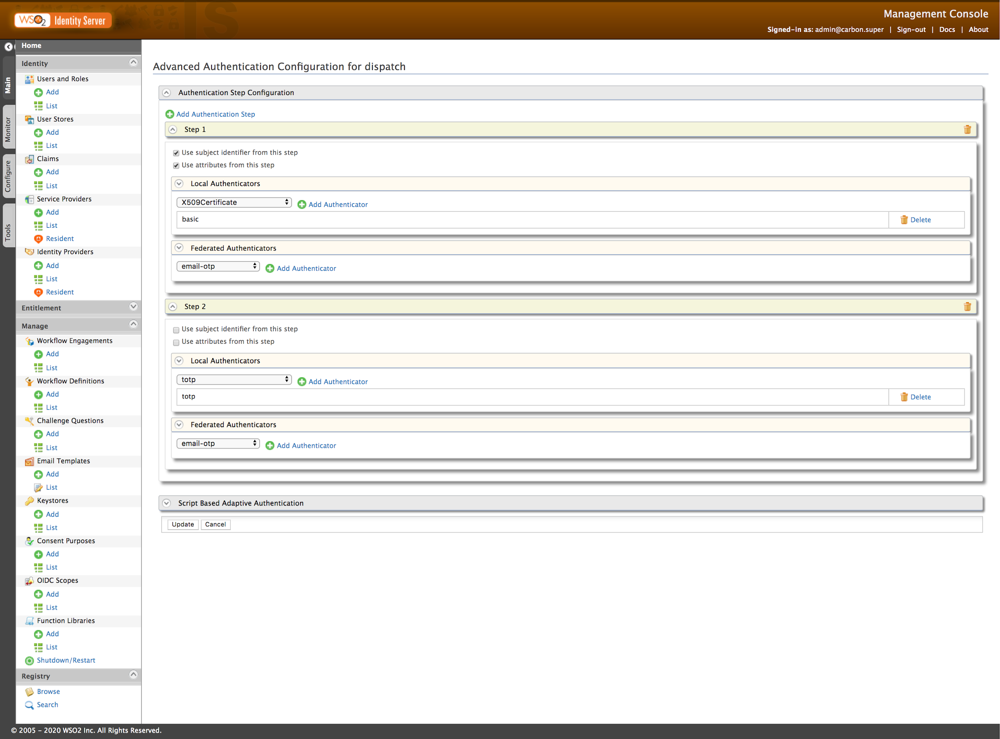
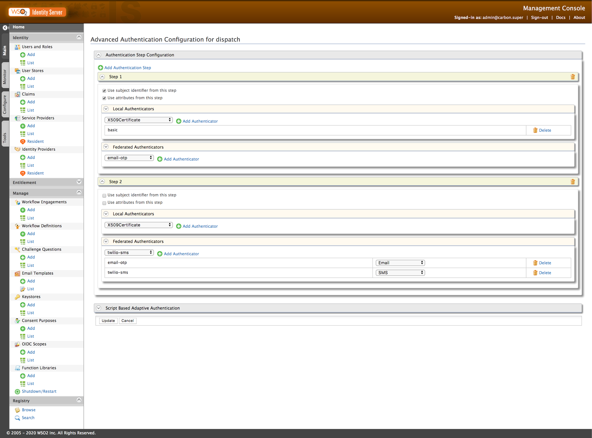
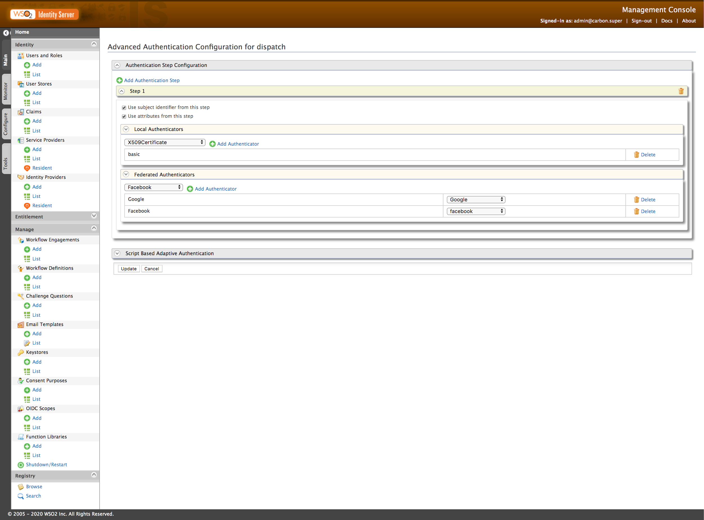

# Basic Docker Demo Walkthrough

*These are steps from a frevious v5.10 setup that have not been verified with v5.11 yet*

1. Configure WSO2 Stream Processor for adaptive authentication

    - [wso2 stream-processor](https://is.docs.wso2.com/en/5.10.0/learn/using-wso2-stream-processor-for-adaptive-authentication/)

    - Change `resident IDP` > `analytics engine`

        Target Host:
        > [https://is.demo.wso2.com:8280/](https://is.demo.wso2.com:8280/)

        UserID:
        >admin

        Secret:
        >admin

1. Resident IDP configurations

    - Enable Self-registration from the management console

    >

    - Enable account recovery

        1. Password recovery  `Email` & `Challenge question based`
        1. Username recovery
        1. Enable ReCaptcha
        1. Enable Recaptcha for sign-in
    >

1. Self Register

    - Access [User-Portal](https://localhost:9443/user-portal) ([https://is.demo.wso2.com:9443/user-portal](https://is.demo.wso2.com:9443/user-portal))

    - Self signup steps

        1. Pick `username`

        1. Enter `mandatory profile details` and `password`

        1. Provide `consent`

        1. Submit

        1. Show `confirmation mail`, but do not click

        1. Try login

        1. The account is not activated, show `Resend` confirmation

        1. Click account verification link

        1. Log-in to the user portal with the new credential

    - User-Portal

        - View and update profile details under personal info

        - Security

            1. Add mobile number for SMS OTP (+947````)

            1. Scan TOTP QR code

            1. Register FIDO device if needed

1. SSO

    - Login to [Dispatch Login](http://is.demo.wso2.com:8080/pickup-dispatch/) - Oauth

    - Login to [PickUp Manager Login](http://is.demo.wso2.com:8080/pickup-manager/) - Oauth

    - Login to [Pickup-Dispatch Login](http://is.demo.wso2.com:8080/saml2-web-app-pickup-dispatch.com/index.jsp) - SAML

    - Login to [PickUp Manager Login](http://is.demo.wso2.com:8080/saml2-web-app-pickup-manager.com/index.jsp) - SAML

1. MFA

    - MFA with TOTP

        - Edit one of the Service Provider application from management console (  ex: dispatch application)

        - Under "Local & Outbound Authentication Configuration" add ‘totp’ as second step

        >

        - Demonstrate login to the application with totp

    - MFA with email OTP

        - Edit one of the Service Provider application from management console (  ex: dispatch application)

        - Under "Local & Outbound Authentication Configuration" add ‘email-otp’ IDP as the second step

        >

        - Demonstrate login to the application with email OTP

    - Multi option

        - Edit one of the Service Provider application from management console (  ex: dispatch application)

        - Under "Local & Outbound Authentication Configuration" add ‘emai-otp’ and ‘SMS-OTP’ IDPs as the second step

        >

        - Demonstration on multi options for 2nd factor

1. Social sign-in

    - Facebook and Google

        - Edit one of the Service Provider application from management console (  ex: dispatch application)

        - Under "Local & Outbound Authentication Configuration" add ‘Google’ and ‘Facebook’ IDPs as options for 2nd step

      >

        - Demonstrate login with FB and Google

    - JIT provisioning

        - Enable JIT provisioning for ‘Google’ idp.

        - Login again with google account and show provisioned account

1. Adaptive authentication
    - [A new device based](https://is.docs.wso2.com/en/5.10.0/learn/configuring-new-device-based-adaptive-authentication/)

    - [Age-based](https://is.docs.wso2.com/en/5.10.0/learn/configuring-user-age-based-adaptive-authentication/)

    - [Risk-Based](https://is.docs.wso2.com/en/5.10.0/learn/configuring-risk-based-adaptive-authentication/)

        - Use TOTP for second-factor authentication

## Guidelines to add new use-cases to the demo setup

If you add any new use-case to the setup, please follow the guidelines given below to update the setup with the new changes.

1. Configure a new use-case from the management console.

1. Other than the UI changes, if you need to change any other file config you can access the docker container with the following,

      ```shell
      docker exec -it -u root <container name> /bin/bash
      ```

1. Find the container id of active Identity Server

docker ps

1. Copy the database files from the IS container to the local machine

      ```shell
      docker cp <container_ID>:/home/wso2carbon/wso2is-5.10.0/repository/database/ .
      ```

1. Copy the files inside the copied database folder into Basic-Docker-Demo-v3/wso2is/files/database

1. If your use case has any changes to the user base then copy the /repository/data folder content into Basic-Docker-Demo-v3/wso2is/files/data

      ```shell
      docker cp <container_ID>:/home/wso2carbon/wso2is-5.10.0/repository/data/ .
      ```

1. Copy any other files related to the changes that you have done into Basic-Docker-Demo-v3/wso2is/files and add the below command to the Dockerfile as,

      ```shell
      COPY --chown=wso2carbon:wso2 ${FILES}/<file path> /home/wso2carbon/wso2is-5.10.0/<directory path>/
      ```

1. Zip the setup and store it as a new version in the drive

1. Add the new use-case to the `Configuration Guidelines` section of this document
