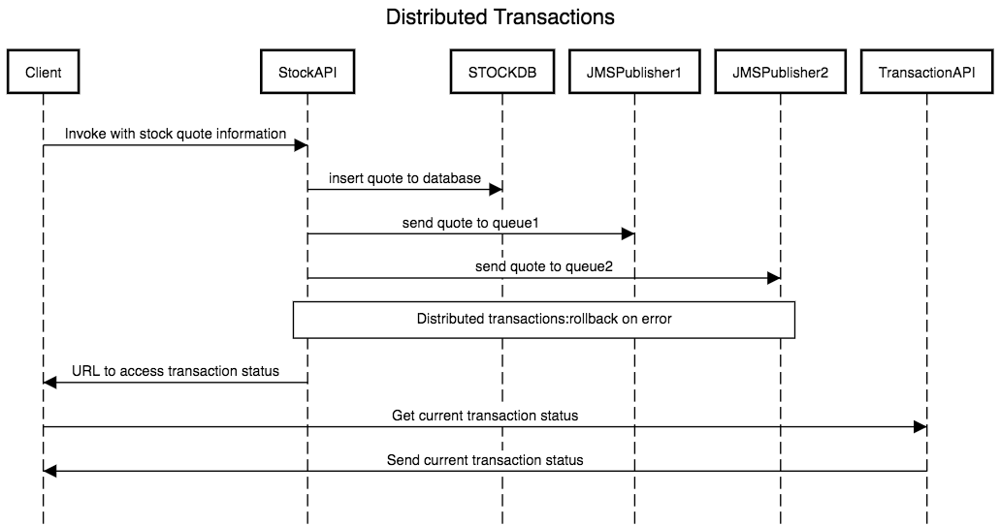

## EI Distributed Transactions setup

This docker setup demonstrates performing distributed transactions in EI. The demo setup covers following aspects.

- Transaction mediator performing distributed transactions for a database resource and two JMS resources.
-  Rollback XA transactions on fault occurences.
-  Final response to client includes a URL, which can be invoked to retrieve the current transaction status ranging from "Begin"/"End"/"Fault".

## Versions

* [**v1.0.0**](v1.0.0) - Setup using Mysql 5.7.21,ActiveMQ 5.8.0 and WSO2ei- 6.1.1

## How to run

1. Install docker into your setup environment.
2. Clone this Git repository. If you need to download only this demo scenario follow this blog.
3. Depending on the demo verison you choose to run, download the desired wso2ei-x.x.x.zip WUM updated zip file.
4. Copy the wso2ei-x.x.x.zip file into presales-demos/ei-distributed-transactions/vX.X.X/ei-setup/ location.
5. Go to presales-demos/ei-distributed-transactions/vX.X.X/ location and run the following commands.

## Below command will build and run the full setup.

    docker-compose build
    docker-compose up

**Optional**
If you need to start the services as background processes execute the following command.

    docker-compose up -d

If you need to build the images individually you can execute the commands in-order as following.

    docker-compose build mysql-service
    docker-compose build activemq-service
    docker-compose build ei-service

To run the services individually you can execute the commands in-order as following.

    docker-compose up mysql-service
    docker-compose up activemq-service
    docker-compose up ei-service

To stop the services execute the following command.

    docker-compose down

To access the management console of EI, use the docker host IP and port 9443.
`https:[DOCKER_HOST]:9443/carbon`

To access the web console of activemq, use the docker host IP and port 8161.
`http://[DOCKER_HOST]:8161/admin`

In here, [DOCKER_HOST] refers to hostname or IP of the host machine on top of which containers are spawned.

## Setup

