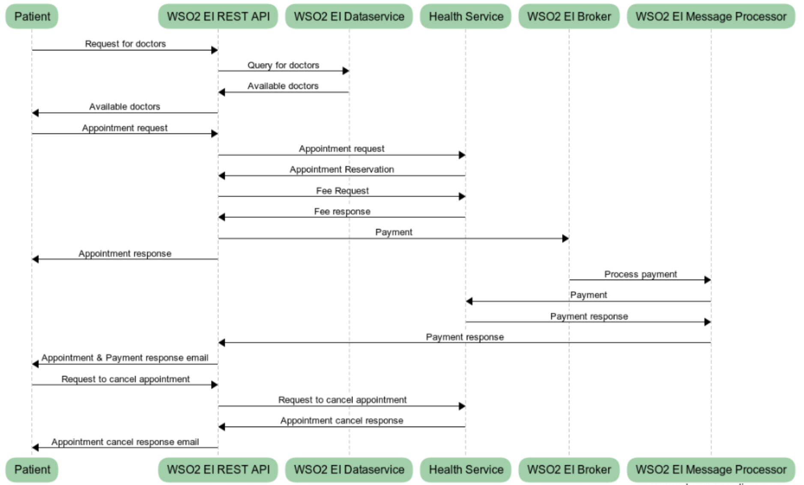

# EI Quick Start Guide setup
This docker setup demonstrate the EI quick start guide setup.

## Versions
* [**v1.0.0**](v1.0.0) - Setup using EI 6.1.1
  * Documentations: [EI Quick Start Guide](https://docs.wso2.com/display/EI611/Quick+Start+Guide)

## How to run
1. Install docker into your setup environment
2. Clone this Git repository
3. Depending on the demo version you choose to run, download the desired **wso2ei-x.x.x.zip**
4. Copy the **wso2ei-x.x.x.zip** file into **presales-demos/ei-quick-start-guide/vX.X.X/ei-setup/** location
5. Copy the **wso2ei-x.x.x.zip** file into **presales-demos/ei-quick-start-guide/vX.X.X/bps-setup/** location
6. Copy the **wso2ei-x.x.x.zip** file into **presales-demos/ei-quick-start-guide/vX.X.X/ei-analytics-setup/** location
7. Go to **presales-demos/ei-quick-start-guide/vX.X.X/** location and run the following commands.
    ```bash
    ## Below command will build and run the full setup.
    docker-compose build
    docker-compose up
    ```
    **Optional**  
    If you need to start the services as background processes execute the following command.
    ```bash
    docker-compose up -d
    ```
    If you need to build the images individually you can execute the commands in-order as following.
    ```bash
    docker-compose build analytics-service
    docker-compose build bps-service
    docker-compose build ei-service
    ```
    To run the services individually you can execute the commands in-order as following.
    ```bash
    docker-compose up analytics-service
    docker-compose up bps-service
    docker-compose up ei-service
    ```
8. To stop the services execute the following command.
   ```bash
   docker-compose down
   ``` 
## Setup 
